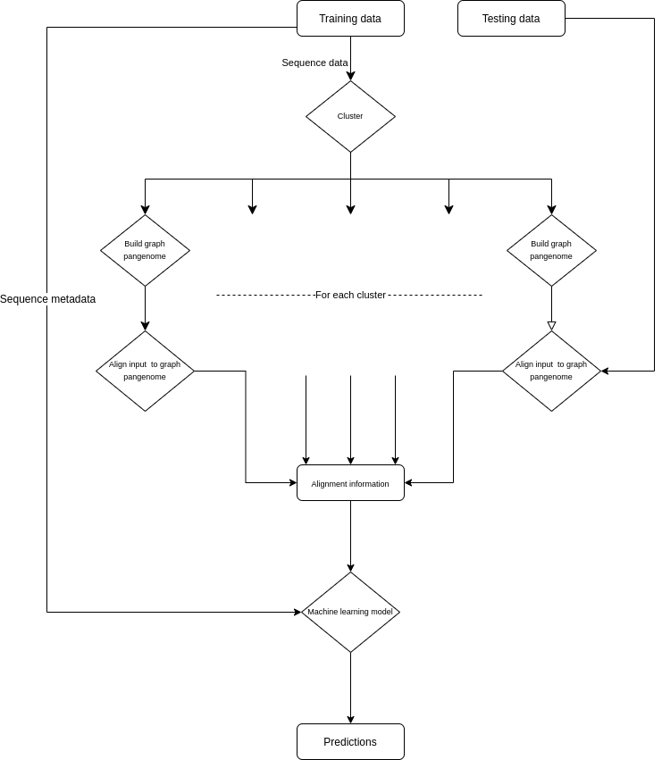

# PanOriginSV

## Please cite our work -- here is the ICMJE Standard Citation:

## Intro statement
PanOriginSV performs lab-of-origin prediction in three distinct steps. First, during the training phase PanOriginSV clusters similar sequences using MMSEQ2. Then we use BCALM to construct pangenome graphs for each cluster and use minigraph to align to the input to their corresponding pangenome graphs. Using the alignment data, we train a random forest model to predict lab of origin.

## What's the problem?
Given a set of genetically engineered sequences, can you predict their lab of origin?

## Why should we solve it?
Determining lab of origin for input sequences has various use cases ranging from attributing the source of dangerous sequences to finding labs who work on similar sequences.

# What is <this software>?



# File structure diagram 
#### _Define paths, variable names, etc_

# Installation options:

We aim to host our package on conda. Until then, the requirements are listed below:

* mmseqs2
* bcalm
* minigraph
* biopython
* scikit-learn
* tqdm


# Running the tool

Below is the syntax for running the tool

```
./loopred -h
usage: loopred [-h] --labels LABELS [--metadata METADATA] [-t THREADS]
               [-o OUTPUT_DIR] [-w WORK_DIR] [--version]
               training-files testing-files

A tool for prediction lab of origin.

positional arguments:
  training-files        A file containing a newline separated list of training
                        fasta files.
  testing-files         A file containing a newline separated list of testing
                        fasta files.

optional arguments:
  -h, --help            show this help message and exit
  --labels LABELS       A file containing two columns. The first is the
                        sequence id and the second is the sequence label.
                        (default: None)
  --metadata METADATA   A tsv file containing metadata for the testing and
                        training sequences. The first column must be the
                        sequence id. (default: None)
  -t THREADS, --threads THREADS
                        Number of threads to use. (default: 1)
  -o OUTPUT_DIR, --output-dir OUTPUT_DIR
                        Location of intermediate files. (default: loopred_out)
  -w WORK_DIR, --work-dir WORK_DIR
                        Location of intermediate files. Defaults to random
                        directory in /tmp (default: None)
  --version             show program's version number and exit
```
